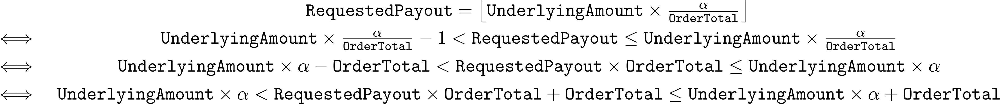

# ZenDex

## Verify/Build

To verify/record hints, run `zebra e --z3rlimit 8000000 Dex001.fst`.  
This command may take a long time to run the first time.
Subsequent runs will be significantly faster.
With an AMD Threadripper 1950x @4.0GHz, recording hints can take up to 2 minutes. Subsequent runs take ~11s.

To build, run `zebra c --z3rlimit 8000000 Dex001.fst`

## How it works

ZenDex is a true decentralised exchange, with no operator or fees.

ZenDex stores orders as utxos that it locks to itself.
In this manner, we avoid having a shared state, allowing great parallelism.

When an order is made, the order parameters are hashed together.
ZenDex mints a single token with that hash as it's sub-identifier (the '*order asset*'),
and locks that to itself.

When an order is taken or cancelled, that token is destroyed.
In the case of a partial fill,
ZenDex will create a new order with reduced quantities of the underlying and order total.
The previous order is still destroyed.

When cancelling or taking an order,
one must supply all of the order parameters directly to ZenDex in the messageBody,
because ZenDex does not store this information, and only possesses a hash of the order.

Order books can be constructed by folding over the blockchain,
and looking for transactions involving ZenDex.

## Usage

ZenDex accepts three commands: `"Make"`, `"Cancel"`, and `"Take"`.

### Making an order

Use the command `"Make"`. You must sign with a public key -
if the sender is `Anonymous` or `Contract contractID`, then the transaction will fail.

The messageBody must consist of a dictionary which includes the following fields:

| Field Name | Type | Description |
|:----------:|:----:| ----------- |
| `"UnderlyingAsset"` | `String` | The identifier of the underlying asset |
| `"UnderlyingAmount"` | `UInt64` | The amount of the underlying asset used to make the order |
| `"PairAsset"` | `String` | The identifier of the pair asset |
| `"OrderTotal"` | `UInt64` | The total amount of the pair being ordered |
| `"MakerPubKey"` | `PublicKey` | The public key of the order maker |

The amount of the underlying made available to ZenDex in the transaction must be equal to `"UnderlyingAmount"`.
The public key used to sign the transaction must be the same as `"MakerPubKey"`.

### Cancelling an order

Use the command `"Cancel"`. You must sign with the public key that was used to create the order.

The messageBody must consist of a dictionary which includes the following fields:

| Field Name | Type | Description |
|:----------:|:----:| ----------- |
| `"UnderlyingAsset"` | `String` | The identifier of the underlying asset of the order|
| `"UnderlyingAmount"` | `UInt64` | The amount of the underlying asset used to make the order |
| `"PairAsset"` | `String` | The identifier of the pair asset in the order |
| `"OrderTotal"` | `UInt64` | The total amount of the pair that was ordered |
| `"MakerPubKey"` | `PublicKey` | The public key of the order maker |

The transaction must place the order asset in ZenDex's contract wallet,
as well as a sufficient quantity of the underlying.

### Taking an order

Use the command `"Take"`.

The messageBody must consist of a dictionary which includes the following fields:

| Field Name | Type | Description |
|:----------:|:----:| ----------- |
| `"UnderlyingAsset"` | `String` | The identifier of the underlying asset of the order|
| `"UnderlyingAmount"` | `UInt64` | The amount of the underlying asset used to make the order |
| `"PairAsset"` | `String` | The identifier of the pair asset in the order |
| `"OrderTotal"` | `UInt64` | The total amount of the pair that was ordered in the order being taken |
| `"MakerPubKey"` | `PublicKey` | The public key of the order maker |
| `"RequestedPayout"` | `UInt64` | The amount of the underlying to pay out |
| `"ProvidedAmount"` | `UInt64` | The amount of the pair supplied |

The transaction must place the order asset being taken and a sufficient amount of the underlying in ZenDex's contract wallet,
and must lock an amount α of the order's pair asset to the contract, where

## Notes

Orders are expressed in terms of underlying amount and pair amount to allow for rational price ratios - eg. a trade of 5α for 7β, or 13β for 11γ.
This is not easily expressed as a 'price per' with only integer arithmetic.
The payout for a partial fill should, assuming arbitrarily divisible assets, be calculated as 

However, since we do not have arbitrarily divisible assets, we denote orders in the smallest unit of each asset and compute the floor, so that

The underlying amount, order total, and payment amount are all 64 bit unsigned integers.
Version 0 ZF* contracts lack integer representations larger than this, and so we are tasked with implementing double-word arithmetic in order to calculate the payoff.
In order to avoid the complexity and potential for error in implementing double-word division,
we instead ask the user to provide the payoff, and validate that it is correct.
Validating that a user's `RequestedPayout` is correct is simpler than computing the payout,
and requires only double-word multiplication and comparison,
both relatively simple compared to double-word division.

Note that

